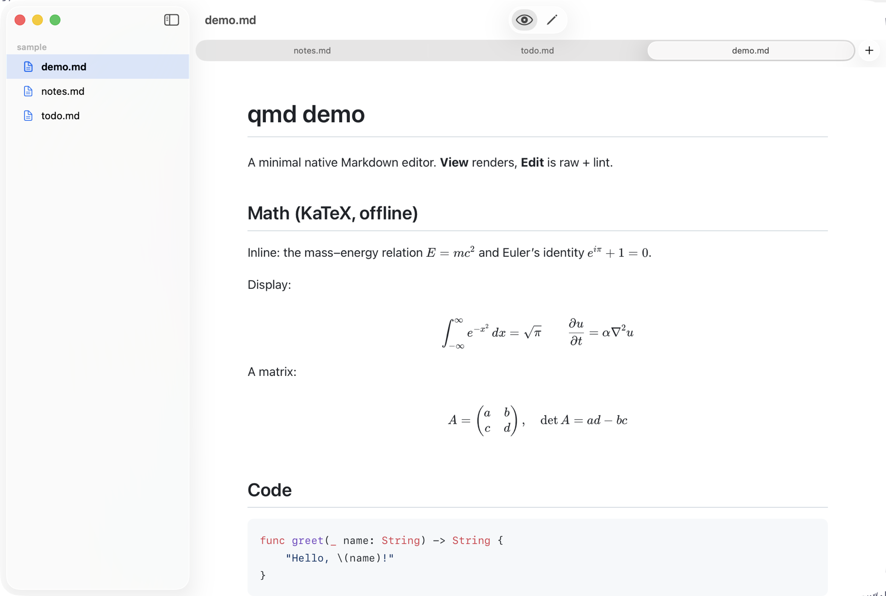
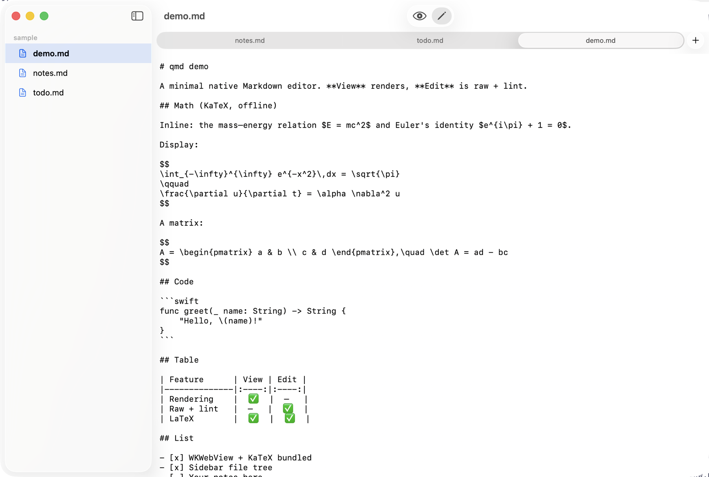

<div align="center">


# qmd

**A minimal, native macOS Markdown editor.**

Two modes — clean **View** and raw **Edit**. Folder sidebar, offline **LaTeX**, and **Quick Look** previews from Finder.


<br>



</div>

---

## View / Edit

Toggle with `⌘E` — *View* renders KaTeX math, tables, and highlighted code; *Edit* is the raw source with linting. The sidebar shows the file's folder, and same-folder files open as tabs.

| View | Edit |
| :---: | :---: |
|  |  |

---

## Features

- 🪶 **Native & minimal** — SwiftUI app, no Electron. Set it as your default `.md` app in Finder.
- 👁️ **View / Edit** — switch with a single toggle (`⌘E`). View renders cleanly; Edit is raw text with lightweight Markdown linting.
- 📐 **LaTeX math** — inline `$E=mc^2$` and display `$$…$$`, rendered offline with [KaTeX](https://katex.org). No network, ever.
- 🗂 **Folder sidebar** — opening a file shows its parent folder's tree. Toggle with `⌘\` (animated). Close it for a distraction-free view.
- 🔖 **Smart tabs** — files in the **same folder** open as tabs; files from a **different folder** open in a new window. Jump with `⌘1`–`⌘9`, cycle with `⌘⌥←` / `⌘⌥→`.
- 👀 **Quick Look** — press <kbd>space</kbd> on any `.md` in Finder for a fully rendered preview (math, tables, syntax-highlighted code).
- 🎨 **GitHub-style rendering** — tables, task lists, and syntax highlighting via [markdown-it](https://github.com/markdown-it/markdown-it) + [highlight.js](https://highlightjs.org), with automatic light/dark theming.
- 💾 **Remembers window size** across launches.

## Requirements

- macOS **14 (Sonoma)** or later
- [Xcode](https://developer.apple.com/xcode/) 15+
- [XcodeGen](https://github.com/yonyz/XcodeGen) — `brew install xcodegen`

> The web rendering assets (markdown-it, KaTeX, highlight.js) are **vendored** in `App/Resources/web/`, so no `npm install` is needed to build.

## Install

```bash
git clone https://github.com/yeduk3/qmd.git
cd qmd
./install.sh
```

`install.sh` builds a Release version, copies **qmd.app** to `/Applications`, registers it with Launch Services, sets it as the default handler for Markdown, and enables the Quick Look extension.

To build without installing:

```bash
./build.sh            # Release  -> ~/Library/Developer/Xcode/DerivedData/qmd-build/...
./build.sh Debug      # Debug
```

> Builds intentionally target DerivedData **outside** the repo to avoid Spotlight/indexer churn. `build/`, `DerivedData/`, and the generated `qmd.xcodeproj` are git-ignored — `project.yml` is the source of truth.

## Usage

| Action | How |
|---|---|
| Open a file | Double-click a `.md` in Finder (after install), or drag it onto the app |
| Toggle View / Edit | `⌘E` (or the toolbar switch) |
| Toggle sidebar | `⌘\` |
| Open file as tab | Click a Markdown file in the sidebar (same folder ⇒ tab) |
| Next / previous tab | `⌘⌥→` / `⌘⌥←` |
| Jump to tab _n_ | `⌘1` … `⌘9` |
| Quick Look preview | Select a `.md` in Finder, press <kbd>space</kbd> |

### Make qmd the default Markdown app

`install.sh` does this automatically. To set it manually: right-click any `.md` in Finder → **Get Info** → **Open with** → **qmd** → **Change All…**

## How it works

- **Editor window** — SwiftUI. *View* mode renders Markdown in a `WKWebView` (markdown-it → HTML, KaTeX for math, highlight.js for code). *Edit* mode is an `NSTextView` with soft-wrap and a small line-based linter.
- **Quick Look extension** — Finder's QL sandbox won't let a `WKWebView` spawn its WebContent process, so the extension renders Markdown to **fully static HTML in-process with JavaScriptCore** (KaTeX is pre-expanded to HTML + base64-inlined fonts) and returns it as a data-based `QLPreviewReply`. No JavaScript runs at display time.

  > The Quick Look extension was built by studying **[sbarex/QLMarkdown](https://github.com/sbarex/QLMarkdown)** — its working implementation is what revealed the two non-obvious requirements (`QLIsDataBasedPreview` in the extension `Info.plist`, and that a sandboxed `WKWebView` can't be used directly). Many thanks to that project. 🙏

## Project layout

```
App/                     SwiftUI app
  Viewer/                WKWebView renderer (View mode)
  Editor/                NSTextView + Markdown linter (Edit mode)
  Sidebar/               parent-folder file tree
  Resources/web/         vendored markdown-it · KaTeX · highlight.js · texmath
QuickLook/               data-based Quick Look preview extension (JavaScriptCore)
project.yml              XcodeGen project spec
build.sh / install.sh    build & install scripts
```

## Uninstall

```bash
rm -rf /Applications/qmd.app
```

(Reset the default app for `.md` via Finder → Get Info if desired.)

## Credits & Acknowledgements

- **[sbarex/QLMarkdown](https://github.com/sbarex/QLMarkdown)** — qmd's Quick Look extension was made by **referencing this project**. Studying its source is what made the data-based preview work (see [How it works](#how-it-works)). Huge thanks. 🙏
- Rendering powered by [markdown-it](https://github.com/markdown-it/markdown-it), [KaTeX](https://katex.org), [highlight.js](https://highlightjs.org), and [markdown-it-texmath](https://github.com/goessner/markdown-it-texmath).

## License

[MIT](LICENSE) © yeduk3
